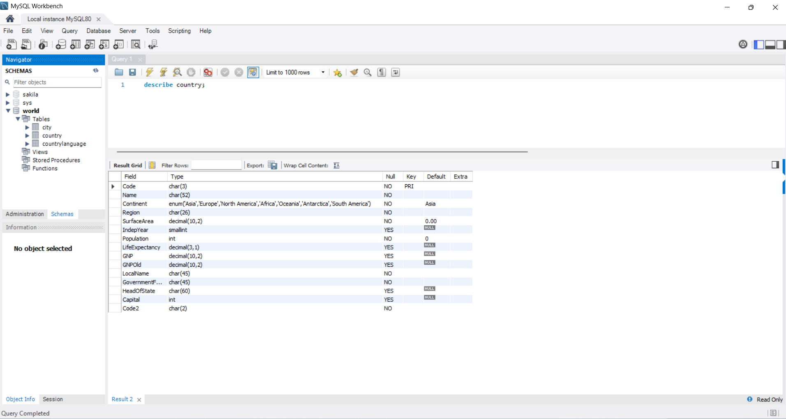
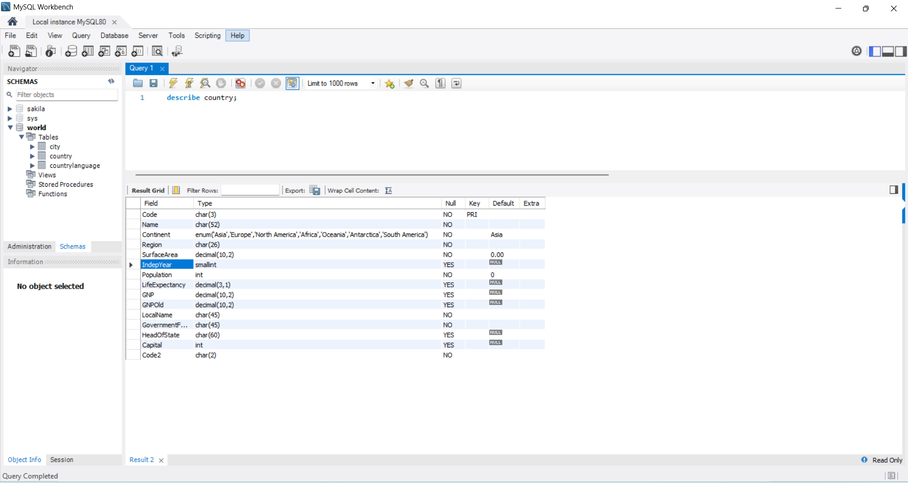
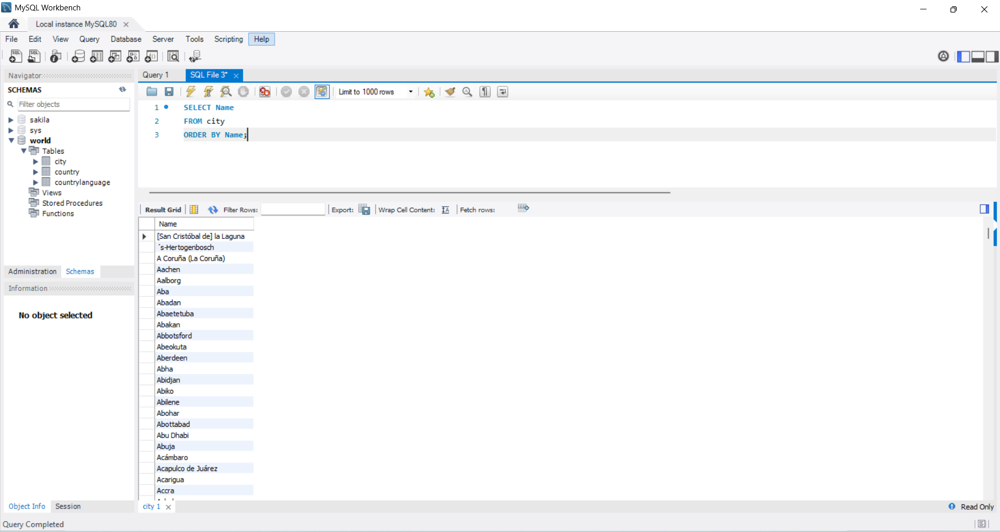
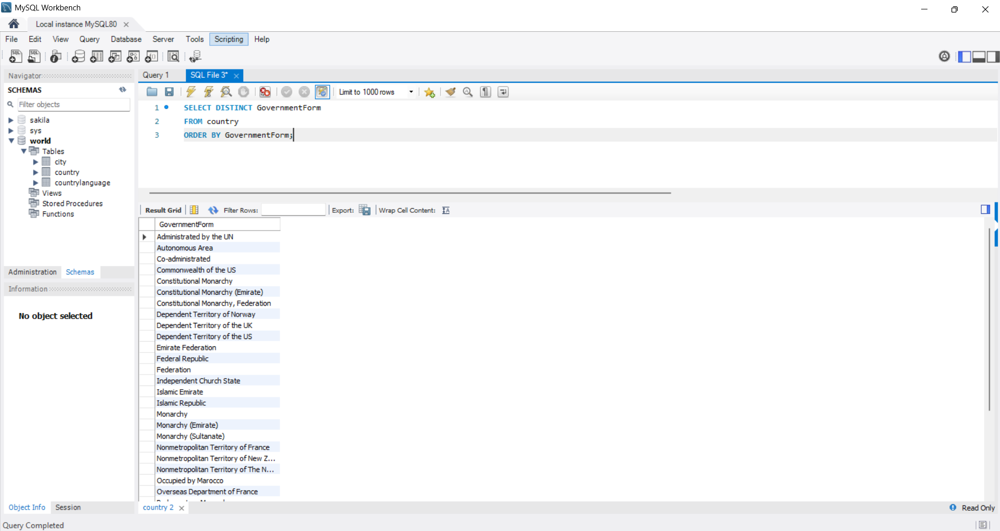
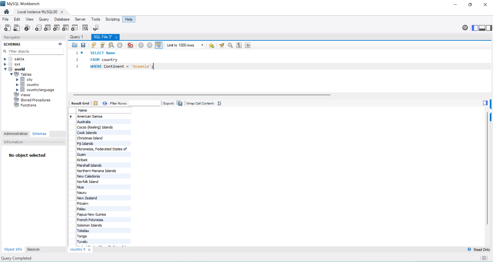
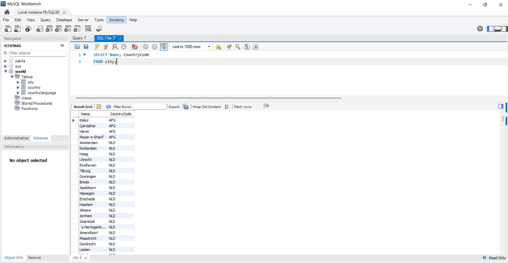
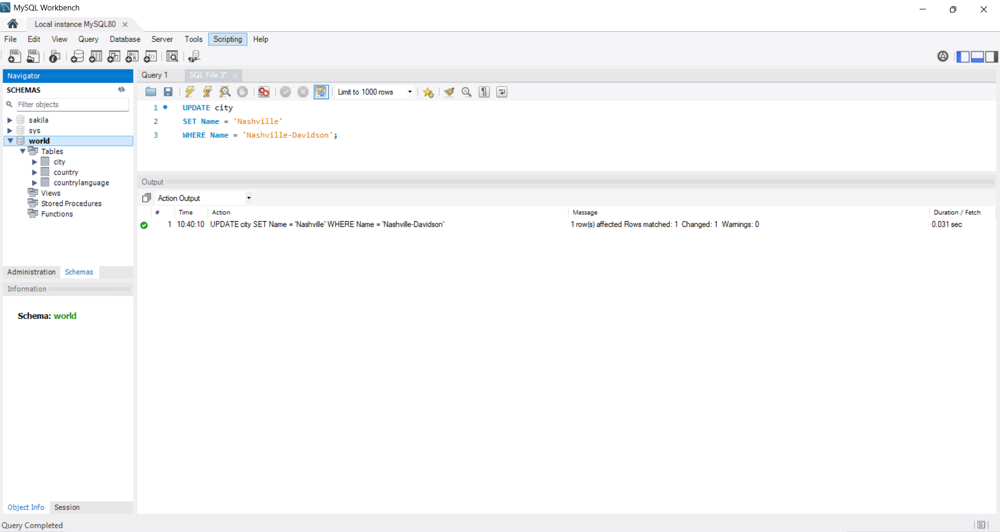
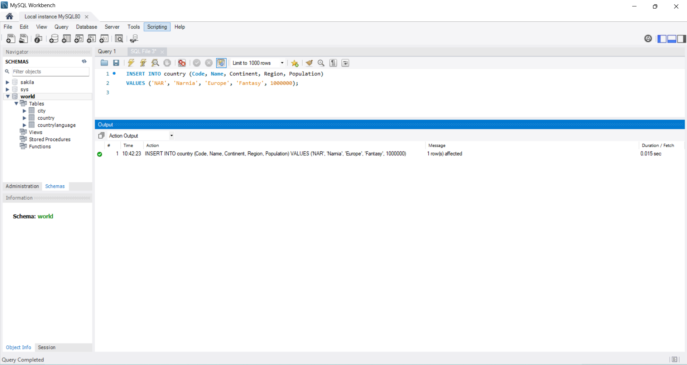
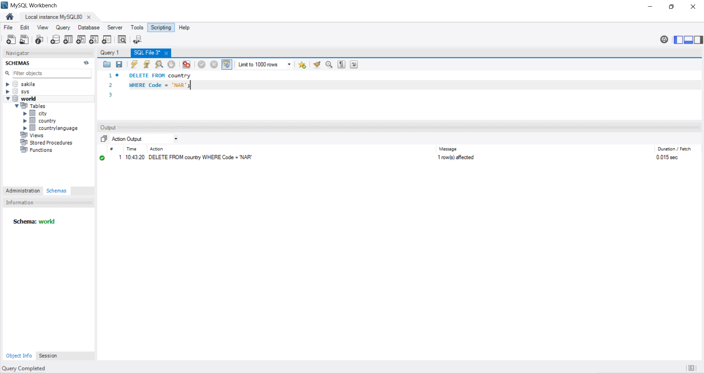

# Exercise 01: World Database SQL Practice

- Name:
- Course: Database for Analytics
- Module: 1
- Database Used: World Database

---

## Instructions

- Answer each question below.
- All SQL commands **must be executed** against the World database.
- For each SQL command:
  - Include the SQL in a fenced code block
  - Include a **screenshot** showing the command and results
- Store screenshots in the `screenshots/` folder and embed them below each answer.

---

## Question 1

**Compare and contrast the data types used for:**
- `country.Population`
- `country.LifeExpectancy`

Why were these data types selected?

### Answer
The country.Population column uses the INT data type because population values represent whole-number counts of people and can grow very large, making an integer type both appropriate and efficient for storage and indexing.
In contrast, the country.LifeExpectancy column uses DECIMAL(3,1) because life expectancy is an averaged measure that requires fractional precision. The decimal type ensures accurate representation of values such as 72.4 years without the rounding errors associated with floating point types.
Together, these choices reflect the nature of the underlying data: populations are discrete whole numbers, while life expectancy requires controlled numeric precision.

### Screenshot
_Show the table structure or DESCRIBE output._

```sql
DESCRIBE country;
```



---

## Question 2

**What is the data type of `country.IndepYear`?**
Why do you think this data type was selected?

### Answer
The country.IndepYear column is defined as a SMALLINT, which is appropriate because independence years fall within a narrow numeric range and do not require the larger capacity of an INT. Using SMALLINT reduces storage while still accommodating all realistic year values. The field is also nullable, reflecting the fact that some countries or territories do not have a clearly defined independence year. This data type therefore balances efficiency with the historical variability of the data

### Screenshot

```sql
DESCRIBE country;
```



---

## Question 3

**Make a case for a different data type for `country.IndepYear`.**
Explain why your proposed data type might be better in some situations.

### Answer
Although SMALLINT is a practical choice for storing independence years, the YEAR data type could be an even better option in some situations. The YEAR type is purpose built for representing calendar years and automatically restricts values to a valid range, reducing the likelihood of incorrect or out of scope entries. Using YEAR also makes the schema more self documenting, clearly signaling that the column is intended to store a year rather than a general integer. In applications where data validation and semantic clarity are important, the YEAR data type may therefore offer advantages over SMALLINT.

---

## Question 4

Write a SQL command to **list the names of all cities in alphabetical order**.

### SQL

```sql
SELECT Name
FROM city
ORDER BY Name;
```

### Screenshot



---

## Question 5

Write a SQL command to **list all forms of government from the `country` table**, showing **each only once**, sorted alphabetically.

### SQL

```sql
SELECT DISTINCT GovernmentForm
FROM country
ORDER BY GovernmentForm;
```

### Screenshot



---

## Question 6

Write a SQL command to **list all countries in the `Oceania` continent**.

### SQL

```sql
SELECT Name
FROM country
WHERE Continent = 'Oceania';
```

### Screenshot



---

## Question 7

Write a SQL command to **list the names and country code of all cities**.

### SQL

```sql
SELECT Name, CountryCode
FROM city;
```

### Screenshot



---

## Question 8

Write a SQL command to **update the city named `"Nashville-Davidson"` to `"Nashville"`**.

### SQL

```sql
UPDATE city
SET Name = 'Nashville'
WHERE Name = 'Nashville-Davidson';
```

### Screenshot



---

## Question 9

Write a SQL command to **insert a new country named `"Narnia"`** with a country code of `"NAR"`.
Use reasonable values for the remaining columns.

### SQL

```sql
INSERT INTO country (Code, Name, Continent, Region, Population)
VALUES ('NAR', 'Narnia', 'Europe', 'Fantasy', 1000000);
```

### Screenshot



---

## Question 10

Write a SQL command to **delete the country with the country code `"NAR"`**.

### SQL

```sql
DELETE FROM country
WHERE Code = 'NAR';
```

### Screenshot


