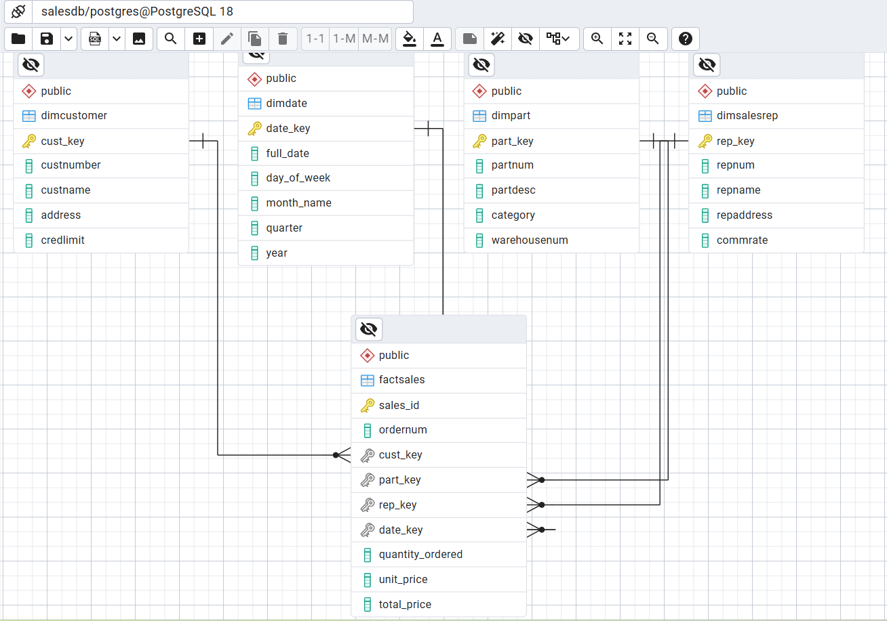

# Module 6 - Exercise 1: Creating a Data Warehouse
From the Operational Model to the Dimensional Model

- Name:
- Course: Database for Analytics
- Module: 6

---

## Overview

In this exercise you will design a **dimensional (star schema) model** for a data warehouse based on an **operational sales database**.

- **Business process:** Customer Sales
- **Grain:** Daily sales
- **Facts to store (only):**
  - **amount** = daily sales total amount (revenue)
  - **quantity** = daily sales total quantity (units sold)

You will determine the dimensions needed to support the required analytics.

---

## Operational Database Summary (Source System)

Tables in the operational model include:

- `customer` (custNumber, custName, address, currBal, credLimit, repNum)
- `parts` (partNum, partDesc, category, unitsOnHand, warehouseNum, unitPrice)
- `slsrep` (repNum, repName, repAddress, totComm, commRate)
- `orders` (orderNum, orderDate, custNum)
- `orderline` (orderNum, partNum, numOrdered)

---

## Analytics Requirements (What the Warehouse Must Support)

Your dimensional model must support questions such as:

- How many of part number **ax12** were sold on **September 2, 1994**?
- How many of part number **ax12** did customer **124** purchase last year?
- How much did customer **124** spend last year?
- What was the **average amount spent per customer per day** during September 1994?
- What was the **average quantity sold of part ax12 per day** during September 1994?
- What was the **average daily sales** during the third quarter of 1994?
- How many **appliance** items were sold during the third quarter of 1994?
- What was the amount of revenue generated by customers in **zip code 64468** during September 1994?

---

## Non-Requirements (Do Not Design For These)

We do **not** care about:

- Questions about **specific orders** (order-level reporting)
- Questions about **sales reps**
- Questions about **credit limits, balances**, or other customer finance fields
- Inventory questions (warehouseNum, unitsOnHand, etc.)

---

## Key Design Constraints

- The warehouse must be a **star schema**.
- The fact table must store only:
  - `amount`
  - `quantity`
- Data must be **aggregated as necessary from the operational database before loading**.
- The grain is **daily sales** (not per order, not per orderline).

---

## Your Task

### Step 1: Design the Star Schema

Create a dimensional model that includes:

- One **fact table** (daily customer sales facts)
- Appropriate **dimension tables** (you decide which ones are necessary)

Your model must clearly show:

- Fact table name and fields
- Dimension table names and fields
- Primary keys and foreign keys
- Relationships (dimensions connect to the fact table)

---

## Deliverables

### 1) Star Schema Diagram (Required)

Create and submit a **diagram** of your star schema.

You may use any tool, such as:
- draw.io (diagrams.net)
- PowerPoint
- Google Drawings
- Lucidchart
- Hand-drawn on paper (then take a clear photo)

Save your diagram image in this repo and embed it below.

**File name suggestion:** `star-schema.png` or `star-schema.jpg`

#### Diagram

---

### 2) Design Notes (Required)

In 1-2 short paragraphs, explain:

- What dimensions you chose and why
- Why your fact table grain is daily sales
- How your design supports at least 3 of the required analytics questions

#### Design Notes

- **What dimensions you chose and why**
  - I selected the SalesRep, Customer, Part, and Date dimensions because they represent the core business subjects needed to analyze sales activity. These dimensions capture stable descriptive attributes that allow slicing sales performance by customer, product, representative, and time, which are essential for answering the required analytics questions.
- **Why your fact table grain is daily sales**
  - The fact table uses a daily sales grain because the assignment requires analysis at the day level rather than at the order or transaction level. Storing facts at this grain ensures that all measures quantity, unit price, and total price are aggregated consistently for each customer, product, and date.
- **How your design supports at least 3 of the required analytics questions**
  - This design supports key analytics by enabling filtering and aggregation across dimensions. For example, the Date and Part dimensions allow you to determine how many units of a specific part were sold on a given day, the Customer dimension supports calculating how much a customer spent over a period, and the Date and Part dimensions together allow analysis of average daily sales or category performance during a specific quarter.
