# Module 7 – Final Project: Show Us Your Data

- Name: Saratchandra Golla
- Course: Database for Analytics
- Module: 7
- Database Used:  `movies` (**Dataset:** https://datasets.imdbws.com)
- Tools Used: PostgreSQL (pgAdmin or psql)

## 1. The initial data source
For this project, I used the IMDb public datasets, which are available at: https://datasets.imdbws.com


## 2. The format of your data, include count of column and rows.
The IMDb files are provided in TSV (tab‑separated values) format.

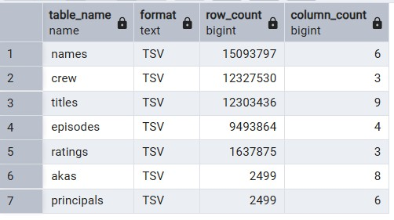


## 3. Show a data dictionary - a table describing each data attribute/feature/column.

- **akas**
    - titleId (string) - a tconst, an alphanumeric unique identifier of the title
    - ordering (integer) – a number to uniquely identify rows for a given titleId
    - title (string) – the localized title
    - region (string) - the region for this version of the title
    - language (string) - the language of the title
    - types (array) - Enumerated set of attributes for this alternative title. One or more of the following: "alternative", "dvd", "festival", "tv", "video", "working", "original", "imdbDisplay". New values may be added in the future without warning
    - attributes (array) - Additional terms to describe this alternative title, not enumerated
    - isOriginalTitle (boolean) – 0: not original title; 1: original title

- **basics**
    - tconst (string) - alphanumeric unique identifier of the title
    - titleType (string) – the type/format of the title (e.g. movie, short, tvseries, tvepisode, video, etc)
    - primaryTitle (string) – the more popular title / the title used by the filmmakers on promotional materials at the point of release
    - originalTitle (string) - original title, in the original language
    - isAdult (boolean) - 0: non-adult title; 1: adult title
    - startYear (YYYY) – represents the release year of a title. In the case of TV Series, it is the series start year
    - endYear (YYYY) – TV Series end year. '\N' for all other title types
    - runtimeMinutes – primary runtime of the title, in minutes
    - genres (string array) – includes up to three genres associated with the title

- **crew**
    - tconst (string) - alphanumeric unique identifier of the title
    - directors (array of nconsts) - director(s) of the given title
    - writers (array of nconsts) – writer(s) of the given title

- **episodes**
    - tconst (string) - alphanumeric identifier of episode
    - parentTconst (string) - alphanumeric identifier of the parent TV Series
    - seasonNumber (integer) – season number the episode belongs to
    - episodeNumber (integer) – episode number of the tconst in the TV series

- **principals**
    - tconst (string) - alphanumeric unique identifier of the title
    - ordering (integer) – a number to uniquely identify rows for a given titleId
    - nconst (string) - alphanumeric unique identifier of the name/person
    - category (string) - the category of job that person was in
    - job (string) - the specific job title if applicable, else '\N'
    - characters (string) - the name of the character played if applicable, else '\N'

- **ratings**
    - tconst (string) - alphanumeric unique identifier of the title
    - averageRating – weighted average of all the individual user ratings
    - numVotes - number of votes the title has received

- **names**
    - nconst (string) - alphanumeric unique identifier of the name/person
    - primaryName (string)– name by which the person is most often credited
    - birthYear – in YYYY format
    - deathYear – in YYYY format if applicable, else '\N'
    - primaryProfession (array of strings)– the top-3 professions of the person
    - knownForTitles (array of tconsts) – titles the person is known for

## 4. Describe some of the obstacles you overcame to transform the data.

I encountered several challenges while preparing and loading the IMDb data:
- Encoding issues: PowerShell defaulted to Windows‑1252, which corrupted UTF‑8 characters. I fixed this by forcing UTF‑8 during extraction.
- Large file sizes: Excel could not open the full TSV files, so I used PowerShell and PostgreSQL’s \copy command.
- Header row errors: The header row caused type‑casting failures (e.g., "birthYear" cannot be cast to SMALLINT), so I removed it before loading.
- Array fields: IMDb stores some fields as comma‑separated lists, so I converted them into PostgreSQL arrays using string_to_array().

## 5. Show your table structure including data types

**Table:** names

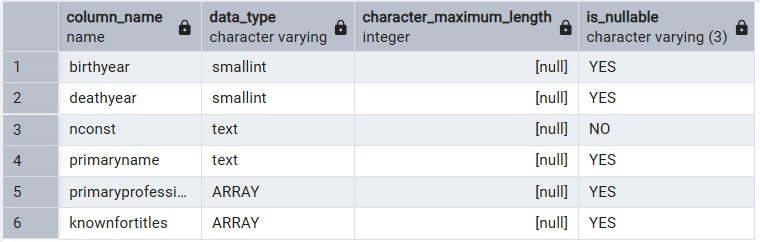

**Table:** titles

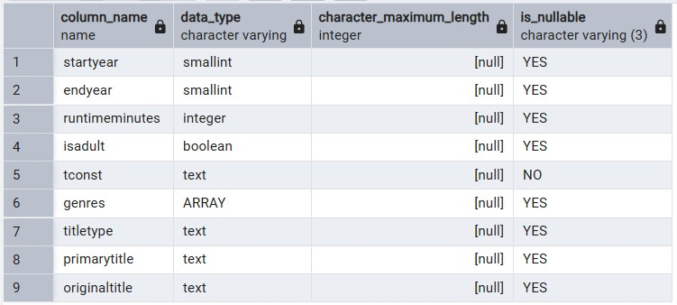

**Table:** episodes

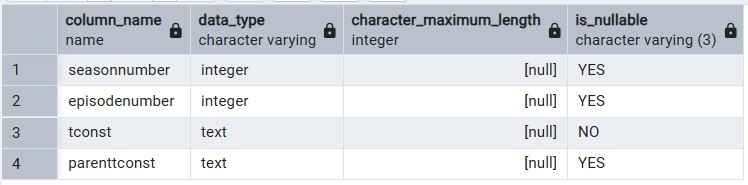

**Table:** ratings

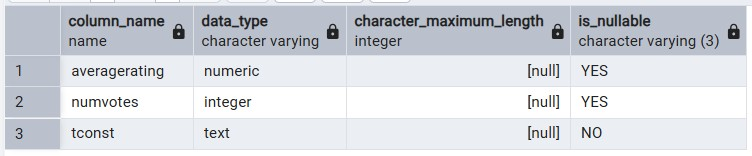

**Table:** crew

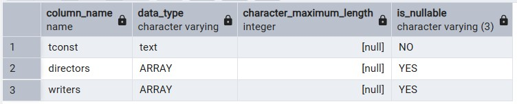

**Table:** akas

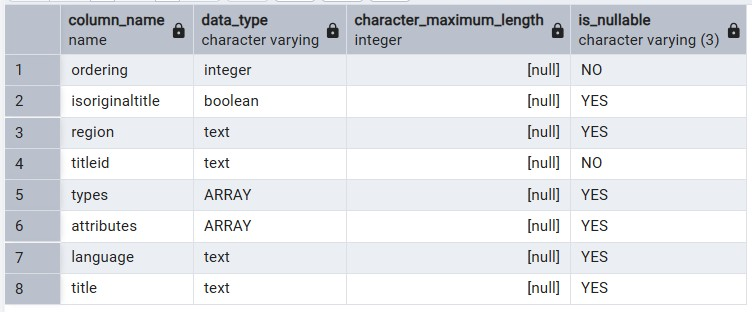

**Table:** principals

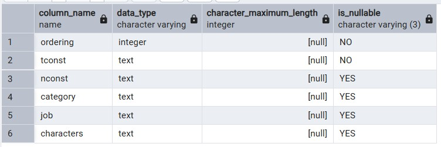


## 6. Select * from each of your tables

**Table:** names

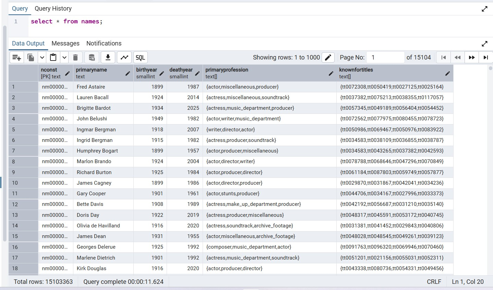

**Table:** titles

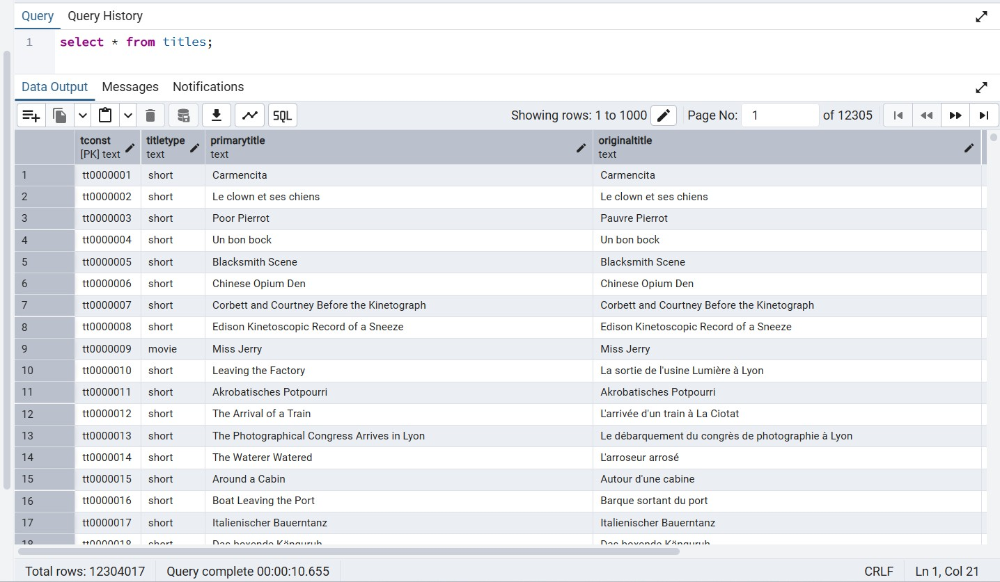

**Table:** episodes

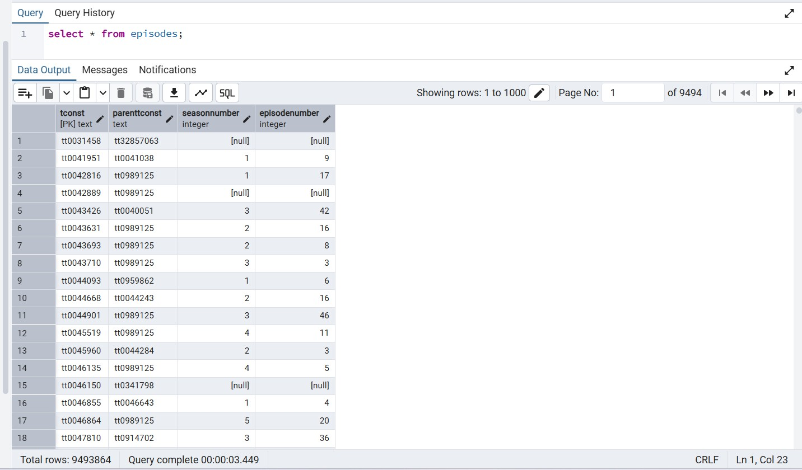

**Table:** ratings

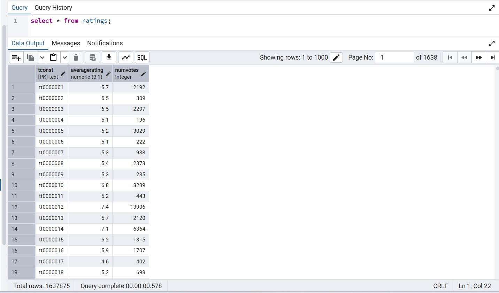

**Table:** crew

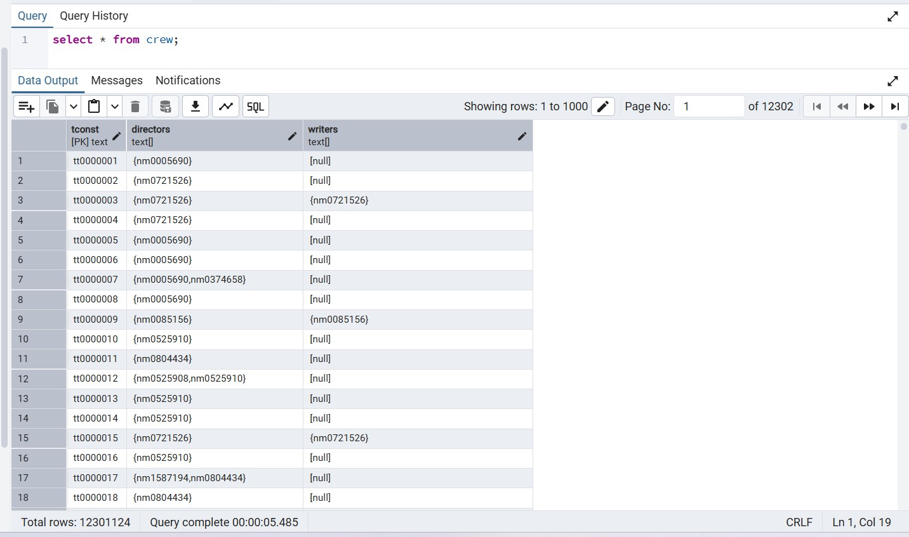

**Table:** akas

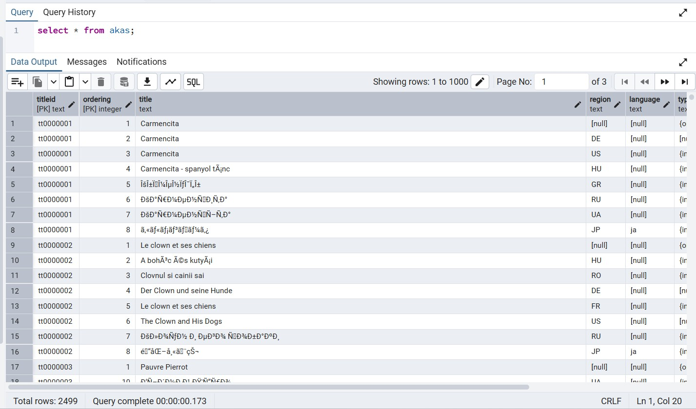

**Table:** principals

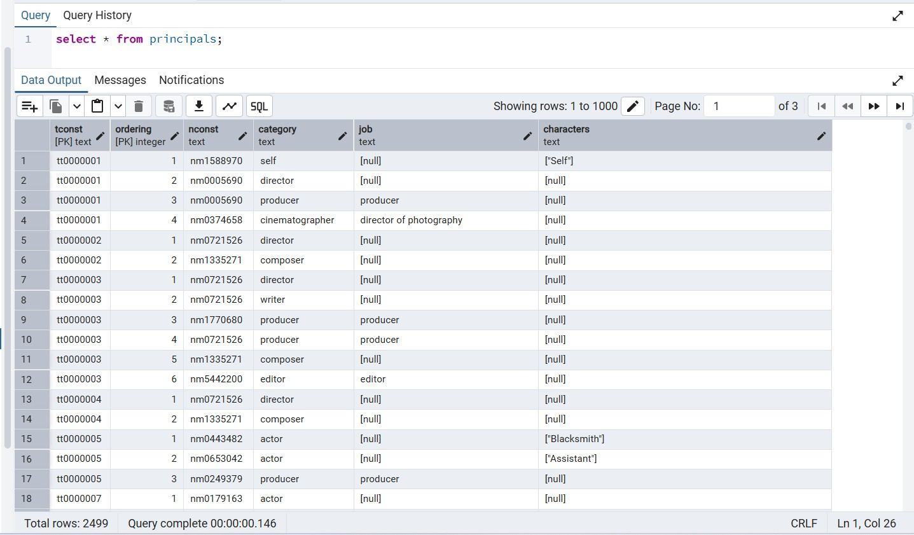

## 7. Show some interesting queries from your tables.  Include:
### At least one join

- **Show all titles a person is known for:**

    ```sql
    SELECT
        n.primaryName,
        t.primaryTitle,
        t.startYear,
        t.genres
    FROM names n
    JOIN nameTitleLink l ON n.nconst = l.nconst
    JOIN titles t ON t.tconst = l.titleID
    WHERE n.nconst = 'nm0000001';
    ```

    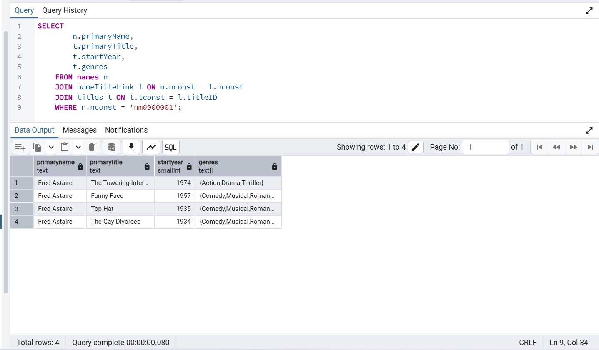

- **List all people associated with a specific title**

    ```sql
    SELECT
        t.primaryTitle,
        n.primaryName,
        n.primaryProfession
    FROM titles t
    JOIN nameTitleLink l ON t.tconst = l.titleID
    JOIN names n ON n.nconst = l.nconst
    WHERE t.tconst = 'tt0000001';
    ```

    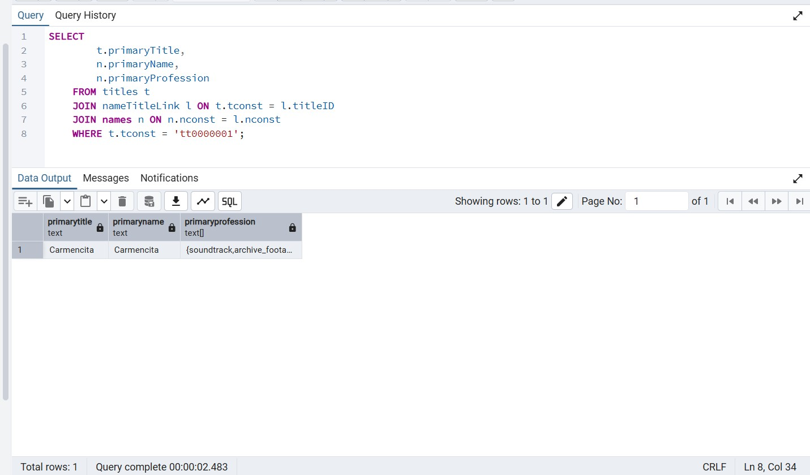

- **Find actors and the movies they are known for Filters by profession and joins to titles**

    ```sql
    SELECT
        n.primaryName,
        t.primaryTitle,
        t.startYear
    FROM names n
    JOIN nameTitleLink l ON n.nconst = l.nconst
    JOIN titles t ON t.tconst = l.titleID
    WHERE 'actor' = ANY(n.primaryProfession)
    ORDER BY n.primaryName
    LIMIT 50;
    ```

    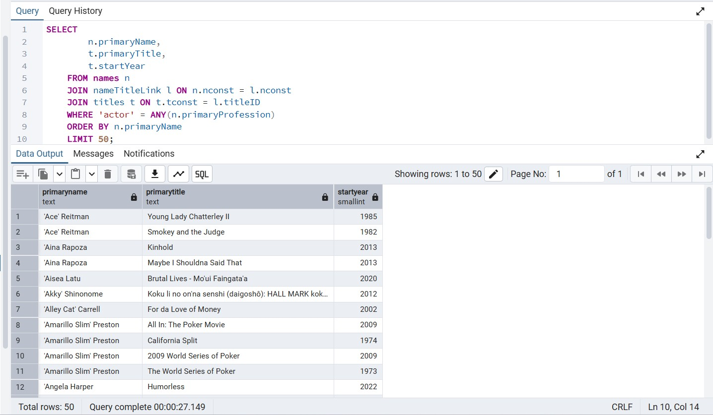

### At least one query where you group by and aggregate data

- **Count how many titles exist per genre:**

    ```sql
    SELECT
        unnest(genres) AS genre,
        COUNT(*) AS total_titles
    FROM titles
    GROUP BY genre
    ORDER BY total_titles DESC;
    ```

    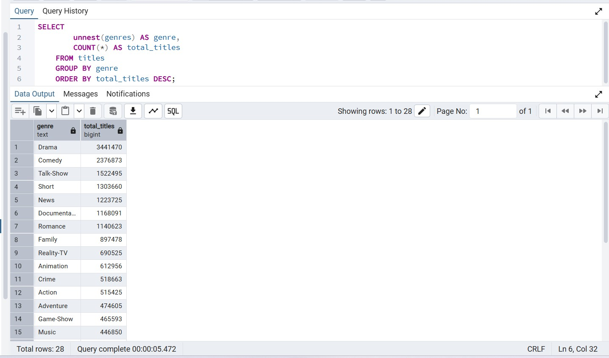

- **Count how many people were born each year Useful for demographic analysis.**

    ```sql
    SELECT
        birthYear,
        COUNT(*) AS total_people
    FROM names
    WHERE birthYear IS NOT NULL
    GROUP BY birthYear
    ORDER BY birthYear DESC;
    ```

    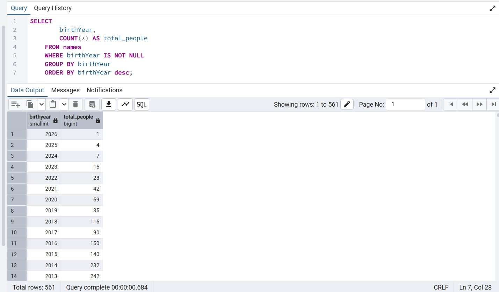
